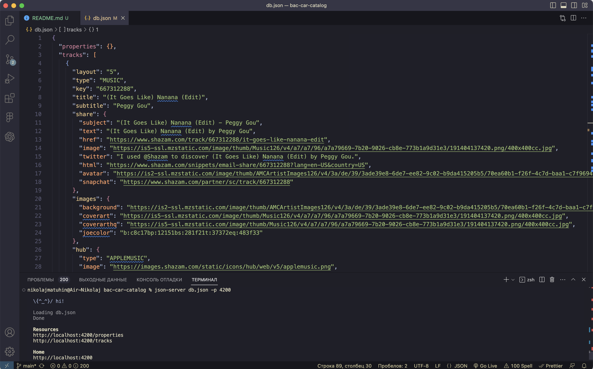
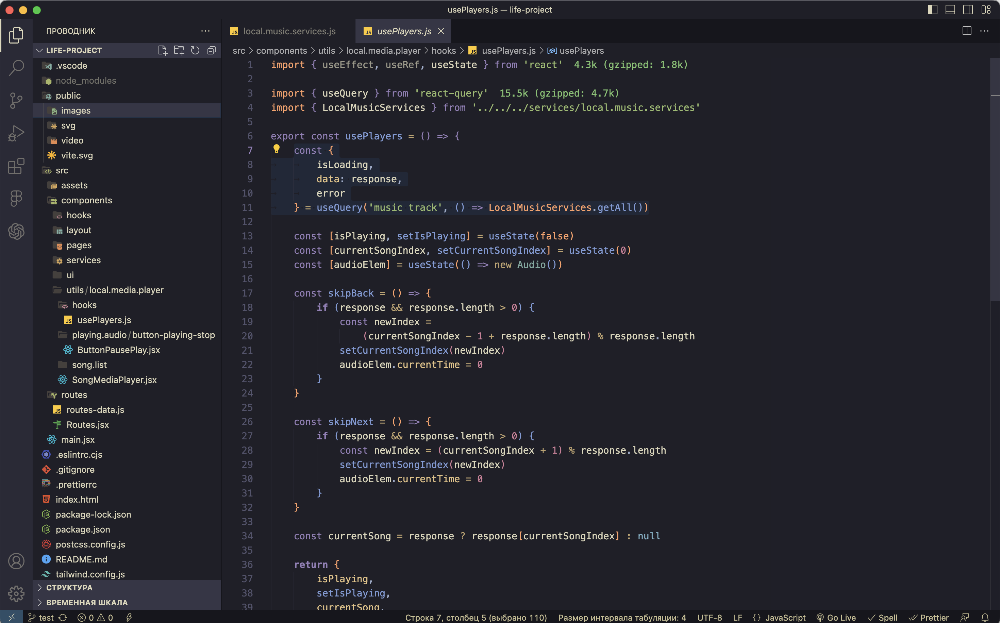
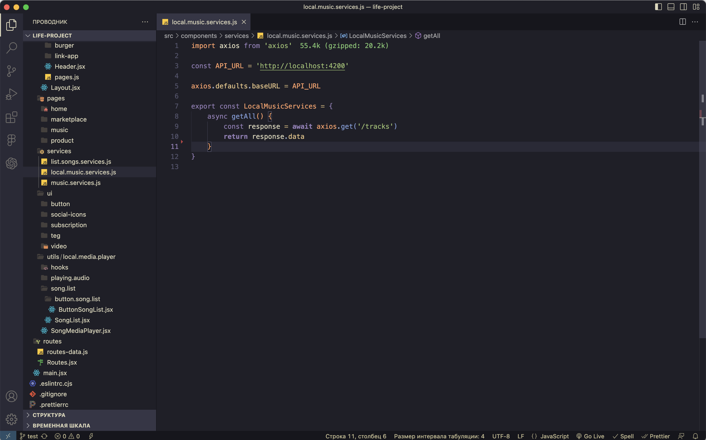
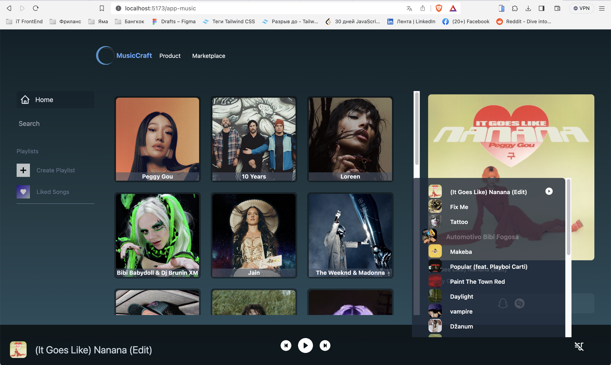

<h1>En </h1> 
<h2 align="center">This structure will allow you to create a fake RESTful API, bypassing the request limit (which is limited to 500 requests) from the website RapidAPI.</h2>

# <h3 align="center">The file "db.json" contains data for processing requests related to music compositions.</h3>

The command <h1>json-server db.json -p 4200</h1> is used to start a local API server using the "json-server" tool. This tool enables you to quickly create a fake RESTful API using data from a JSON file ("db.json"). Your application can send requests to this local server to simulate interaction with a real remote server.

Let's break down each part of the command:
* json-server: This is the command that launches the "json-server" tool.

* db.json: This is a file containing data in JSON format. This data will be provided by the emulated API server.

* -p 4200: This flag specifies the port on which the local server will run. In this case, the server will be accessible at http://localhost:4200.

When you run this command, you'll create a local server that listens on the specified port and provides data from the "db.json" file via routes that correspond to the data structure in the file. For example, if "db.json" contains an array of objects representing "tracks" and "properties" entities, you can obtain a list of users by sending a GET request to:

* http://localhost:4200/properties
* http://localhost:4200/tracks

This is a useful approach for developers to test the interaction between the frontend (e.g., a web application) and the backend (API) in a local environment without the need to set up a real server.

Photo examples:

 
 
 
 

<h1>Рус</h1>
<h2 align="center">Данная структура позволит вам создавать фейковый RESTful API, обходя ограничение на количество запросов (ограничение в 500 запросов) с веб-сайта. <a href="https://rapidapi.com/apidojo/api/shazam" target="_blank">RapidAPI</a> </h2>

# <h3 align="center">В файле db.json содержатся данные для обработки запросов музыкальных композиций.</h3>

Команда  <h1>json-server db.json -p 4200</h1> используется для запуска локального сервера API с использованием инструмента json-server. Этот инструмент позволяет вам быстро создать фейковый RESTful API, используя данные из файла JSON (db.json). Ваше приложение может отправлять запросы к этому локальному серверу для имитации взаимодействия с настоящим удаленным сервером.

Давайте рассмотрим каждую часть команды:

json-server: Это команда, которая запускает инструмент json-server.

db.json: Это файл, содержащий данные в формате JSON. Эти данные будут предоставляться как эмулированный API сервером.

-p 4200: Этот флаг указывает на порт, на котором будет работать локальный сервер. В данном случае, сервер будет доступен по адресу http://localhost:4200.

Когда вы запустите эту команду, вы создадите локальный сервер, который будет слушать указанный порт и предоставлять данные из файла db.json по маршрутам, соответствующим структуре данных в файле. Например, если в db.json есть массив объектов, представляющих сущности tracks и properties, то вы можете получить список пользователей, отправив GET-запрос на  

* http://localhost:4200/properties

* http://localhost:4200/tracks.

Это полезный способ для разработчиков тестировать взаимодействие между фронтендом (например, веб-приложением) и бэкендом (API) в локальной среде без необходимости настройки настоящего сервера.

* Примеры фотографий 

 
 
 
 

